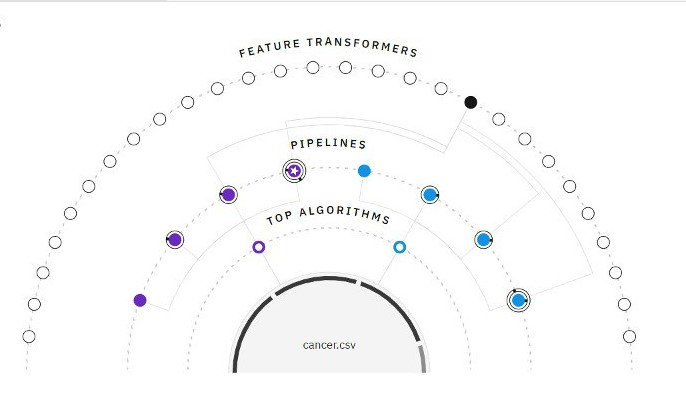
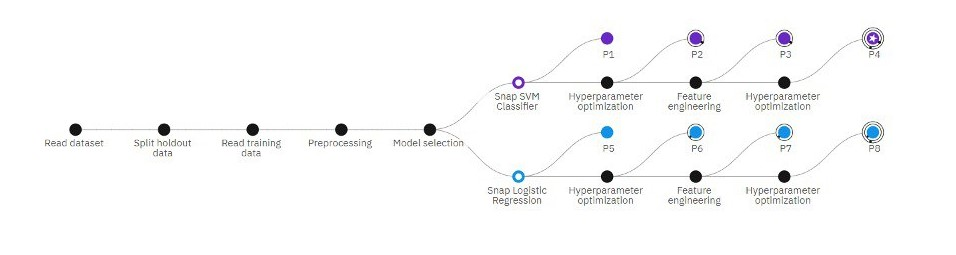

# iris_flower_classification

## Introduction:
Iris flower classification is a classic problem in machine learning. It involves using a machine learning model to classify iris flowers into three different species: Iris Setosa, Iris Versicolor, and Iris Virginica. The model is trained on a dataset of iris flower measurements, including sepal length, sepal width, petal length, and petal width. Once trained, the model can then be used to predict the species of a new iris flower based on its measurements.

## Iris_flower:

## The steps involved in iris flower classification:
1.**Data Collection:** The first step is to collect data on iris flowers. This data typically includes measurements of the sepals and petals of the flowers. The Iris flower dataset is a good example of a dataset that can be used for iris flower classification.

2.**Data Preprocessing:** Once you have collected your data, you will need to preprocess it before you can use it to train your machine learning model. This may involve cleaning the data, scaling the data, and encoding categorical variables.

3.**Model Selection:** There are many different machine learning models that can be used for iris flower classification. Some popular choices include decision trees, support vector machines, and k-nearest neighbors.

4.**Model Training:** Once you have selected a model, you will need to train it on your data. This involves feeding the model your training data and allowing it to learn the patterns in the data.

5.**Model Evaluation:** Once your model is trained, you will need to evaluate it on a separate test dataset. This will help you to determine how well your model is generalizing to unseen data.

6.**Prediction:** Once you are satisfied with the performance of your model, you can use it to predict the species of new iris flowers.

This pipeline provides a basic framework for iris flower classification. The specific tools and techniques may vary depending on the chosen programming language and libraries.

## Relationship_map:

## Progress_map:

This flowchart outlines the steps involved in classifying iris flowers using machine learning:

1.**Start:** The process begins here.

2.**Data Collection:** Collect data on iris flowers, including sepal and petal measurements. You can use the Iris flower dataset for this purpose.

3.**Data Preprocessing:** Clean, scale, and encode your data as necessary. This ensures the data is suitable for machine learning models.

4.**Model Selection:** Choose a machine learning model for classification. Popular options include decision trees, support vector machines, and k-nearest neighbors.

5.**Model Training:** Split your data into training and testing sets. Train your chosen model on the training data. The model learns patterns from the data.

6.**Model Evaluation:** Evaluate the model's performance on the unseen testing data. This assesses how well the model generalizes to new data.

7.**(Yes) Improve Model:** If the model's evaluation results are unsatisfactory, go back to step 4 and try a different model or adjust hyperparameters of the current model.

8.**(No) Make Predictions:** If the model performs well, use it to predict the species of new iris flowers based on their measurements.

9.**End:** The process ends here after successfully classifying new iris flowers.

This is a simplified view, and some steps might involve additional details depending on the chosen techniques.

